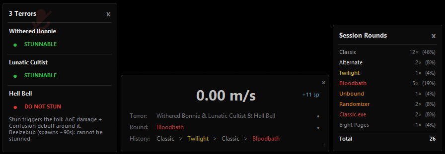

# ToN Overlay

A vibecoded desktop overlay for **Terrors of Nowhere** on VRChat.

Displays live game info on a compact always-on-top HUD: current terror, round type, movement speed, session survivals, and round history. Click the terror name for full stun info. Click the round type for session stats.



Desktop only.

> **Work in progress.** Terror data is maintained manually and may be outdated or incorrect — the game updates frequently. The current April Fools event may also cause round types and terror combinations to behave differently than the overlay expects. Trick or Treat rounds will always display wrong map and terror info. If something else is wrong, open an issue.

---

## Requirements

- Python 3.x (no extra packages needed) — only required if running the `.py` directly
- [ToNSaveManager](https://github.com/ChrisFeline/ToNSaveManager) running with **WebSocket API Server enabled** (Settings > WebSocket API Server > toggle on)
- VRChat with OSC enabled (Settings > OSC > toggle on)

---

## Download

[](https://github.com/floxinyl/ton-overlay/releases/latest/download/ton_overlay.exe)

or

Go to the [Releases](../../releases) page and download the latest version.

Two options are available:

- **ton_overlay.exe** — no Python needed, just download and run. Windows only.
- **ton_overlay.py** — run with Python 3.x if you prefer the source directly.

> **Antivirus warning:** The `.exe` is compiled from Python using PyInstaller. Some antivirus programs flag PyInstaller executables as suspicious by default even when the code is completely clean. This is a known false positive with compiled Python apps. If your antivirus blocks it, run the `.py` source file directly instead — that requires Python 3.x installed but no other packages.

---

## How to run

**Using the exe (recommended for most people)**

1. Start VRChat and enable OSC under Settings > OSC.
2. Start ToNSaveManager and make sure WebSocket API Server is toggled on in its settings. Without this the overlay will not receive terror or round data.
3. Run `ton_overlay.exe`.

**Using the Python script**

1. Same steps 1 and 2 as above.
2. Open a terminal in the folder where you saved the file and run:

```
python ton_overlay.py
```

The overlay appears on screen. Drag it wherever you want.

---

## Using the panels

**Terror info panel** — A dot appears next to the terror name when info is available. Click the terror name to open a draggable panel showing the terror's stun status and notes. Click again to close it. On multi-terror rounds it shows a block for each terror. On Unbound rounds it shows the full terror lineup for that round instead.

**Session round counter** — A dot appears next to the round type label once rounds have been counted. Click the round type label to open a draggable panel listing every round type seen this session and how many times it appeared. Updates live. Click again to close.

---

## Features

- Terror name and stun info for all 179 terrors (click terror name to open panel)
- Seven stun categories: Stunnable, Not Stunnable, Avoid, Do Not Stun, Partial, Conditional, Teleports on Stun
- Phase and add breakdowns for complex terrors
- Round type display with session round count popup (click the round label)
- Last 4 rounds history
- Fog round countdown timer
- Speed display in m/s
- Session survival counter
- Lisa auto-reveal on Alternate rounds after 11 seconds
- Full Unbound round terror list (84 rounds)
- Multi-terror support for Bloodbath, Midnight, and Double Trouble
- No external dependencies — standard library only

---

## Notes

- Tested on Windows. Should work on any OS with Python and tkinter installed.
- Terror data sourced from [terror.moe](https://terror.moe).
- All panels are draggable. Close the overlay with the X button on the main window.

---

## Version

v3.3.1
